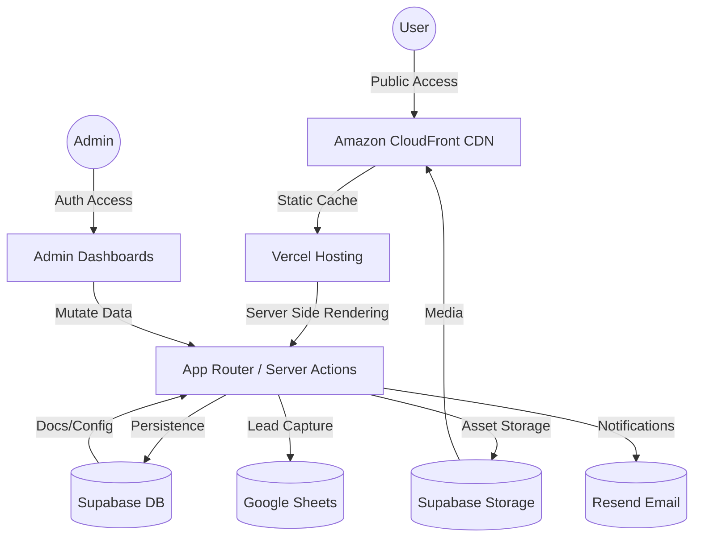

# avrxt | Full-Stack Infrastructure & Personal Engine


A high-performance, premium personal website built with **Next.js 15**, **Supabase**, and **Tailwind CSS**. Designed for speed, security, and absolute control.

## 🚀 Key Features

- **Personal Profile (`/me`)**: Standalone, immersive "Link in Bio" page with live status, music player, and visual feed.
- **Documentation Portal (`/docs`)**: Dynamic, SEO-optimized documentation system powered by Supabase.
- **Admin Dashboards**: Integrated management tools for profiles and documents at `/me/admin` and `/docs/admin`.
- **Media Engine**: Supabase Storage integration for uploading avatars, banners, music, and gallery items directly from the dashboard.
- **Edge Delivery**: Optimized with **Amazon CloudFront CDN** for lightning-fast asset delivery globally.
- **Enterprise Integrations**:
  - **Google Sheets**: Automatic lead capture for Contact and Hire Me forms.
  - **Resend**: Transactional emails and newsletter subscriptions.
  - **Supabase Auth**: Secure, role-based access to administrative tools.

## 🛠️ Technology Stack

- **Framework**: Next.js 15 (App Router)
- **Database/Auth**: Supabase (PostgreSQL + Auth + Storage)
- **CDN**: Amazon CloudFront
- **Hosting**: Vercel (CI/CD Automation)
- **Styling**: Tailwind CSS + Lucide Icons
- **Integrations**: Google Sheets API, Resend, Nodemailer.

## 🏗️ System Architecture



## ⚙️ Environment Configuration

Create a `.env.local` file with the following keys:

```bash
# Supabase
NEXT_PUBLIC_SUPABASE_URL=your_url
NEXT_PUBLIC_SUPABASE_ANON_KEY=your_key
SUPABASE_SERVICE_ROLE_KEY=your_service_role_key

# Google Integration (Lead Capture)
GOOGLE_SERVICE_ACCOUNT_EMAIL=your_email
GOOGLE_PRIVATE_KEY="---BEGIN PRIVATE KEY---\n..."
GOOGLE_SHEET_ID=your_sheet_id
INTAKE_SHEET_ID=your_intake_sheet_id

# Email (Resend)
RESEND_API_KEY=re_...
RESEND_AUDIENCE_ID=...
RESEND_FROM_EMAIL=updates@yourdomain.com

# Email (Gmail Backup)
GMAIL_APP_PASSWORD=...
ADMIN_GMAIL_ID=...

# App URL
NEXT_PUBLIC_API_URL=https://yourdomain.com
```

## 🔐 Administrative Access

Access the admin panels via `/docs/login`. Once authenticated, you can toggle between:
- **Profile Admin**: Edit `/me` content, status, and gallery.
- **Docs Admin**: Create, edit, and publish documentation.

## 🛠️ Deployment

This project is optimized for **Vercel Automation**. Every push to the `main` branch triggers an automatic build and deployment. Assets are cached and served via **Amazon CloudFront** for maximum performance.

---

**Designed and Developed by [@avrxt](https://instagram.com/aviorxt)**  
Built with 🖤
